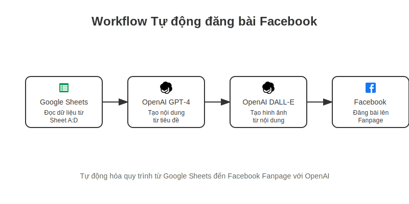

# 🤖 Workflow Tự động đăng bài Facebook



## 📝 Mô tả

Workflow này tự động hóa quy trình đăng bài lên Facebook Fanpage từ dữ liệu trong Google Sheets, sử dụng AI để tạo nội dung và hình ảnh chất lượng cao.

## 🔧 Các thành phần

### 1. Google Sheets
- Đọc dữ liệu từ sheet được chỉ định (cột A-D)
- Cấu trúc dữ liệu:
  - Cột A: Tiêu đề bài viết
  - Cột B: Từ khóa chính
  - Cột C: Tone giọng điệu
  - Cột D: Trạng thái đăng

### 2. OpenAI GPT-4
- Tự động tạo nội dung từ tiêu đề và từ khóa
- Tối ưu hóa theo tone giọng điệu yêu cầu
- Tạo hashtags phù hợp

### 3. OpenAI DALL-E
- Tạo hình ảnh minh họa từ nội dung
- Tùy chỉnh phong cách và kích thước
- Đảm bảo chất lượng hình ảnh cao

### 4. Facebook Graph API
- Tự động đăng bài lên Fanpage
- Đính kèm hình ảnh và hashtags
- Cập nhật trạng thái trong Google Sheets

## ⚙️ Cài đặt

1. Chuẩn bị Google Sheets:
   ```
   ID Sheet | Tiêu đề | Từ khóa | Tone | Trạng thái
   1        | ...     | ...     | ...  | Chưa đăng
   ```

2. Cấu hình API Keys:
   - OpenAI API Key
   - Facebook Graph API Token
   - Google Sheets API Credentials

3. Thiết lập môi trường:
   ```env
   OPENAI_API_KEY=your_key_here
   FACEBOOK_ACCESS_TOKEN=your_token_here
   GOOGLE_SHEETS_CREDENTIALS=your_credentials_here
   ```

## 🎯 Hướng dẫn sử dụng

1. Nhập dữ liệu vào Google Sheets theo mẫu
2. Chạy workflow tự động hoặc thủ công
3. Kiểm tra kết quả trên Facebook Fanpage
4. Theo dõi trạng thái trong Google Sheets

## 🔄 Quy trình làm việc

1. **Thu thập dữ liệu**
   - Nhập tiêu đề và từ khóa vào Google Sheets
   - Chọn tone giọng điệu phù hợp

2. **Tạo nội dung**
   - GPT-4 phân tích và tạo bài viết
   - Tối ưu hóa nội dung theo yêu cầu

3. **Tạo hình ảnh**
   - DALL-E tạo hình ảnh minh họa
   - Tùy chỉnh và kiểm tra chất lượng

4. **Đăng bài**
   - Tự động đăng lên Facebook Fanpage
   - Cập nhật trạng thái trong sheets

## 📊 Theo dõi và báo cáo

- Kiểm tra trạng thái đăng trong Google Sheets
- Theo dõi tương tác trên Facebook
- Phân tích hiệu quả nội dung

## 🚀 Tối ưu hóa

1. **Nội dung**
   - Sử dụng từ khóa phù hợp
   - Tối ưu độ dài bài viết
   - Thêm call-to-action hiệu quả

2. **Hình ảnh**
   - Chọn phong cách phù hợp
   - Tối ưu kích thước và chất lượng
   - Thêm watermark nếu cần

3. **Thời gian**
   - Lên lịch đăng bài hợp lý
   - Tránh thời điểm trùng lặp
   - Theo dõi thời gian tương tác tốt nhất

## 🛠 Xử lý lỗi

1. **Lỗi API**
   - Kiểm tra API keys
   - Xác nhận quyền truy cập
   - Làm mới tokens nếu cần

2. **Lỗi nội dung**
   - Kiểm tra định dạng dữ liệu
   - Xác nhận giới hạn ký tự
   - Điều chỉnh tone giọng điệu

3. **Lỗi đăng bài**
   - Kiểm tra kết nối mạng
   - Xác nhận quyền Fanpage
   - Thử lại sau vài phút

## 📈 Kết quả mong đợi

- Tự động hóa 100% quy trình đăng bài
- Tiết kiệm 80% thời gian quản lý nội dung
- Tăng tương tác trên Facebook Fanpage
- Duy trì chất lượng nội dung nhất quán

## 🤝 Đóng góp

Mọi đóng góp đều được hoan nghênh! Vui lòng:

1. Fork repository
2. Tạo branch mới
3. Commit thay đổi
4. Push lên branch
5. Tạo Pull Request

## 📄 Giấy phép

Dự án này được phân phối dưới giấy phép MIT. Xem file `LICENSE` để biết thêm chi tiết.

## 🙋‍♂️ Hỗ trợ

Nếu bạn cần hỗ trợ hoặc có câu hỏi:

- Tạo Issue trên GitHub
- Gửi email về: haiquangbh1a1b1c@gmail.com
- Tham gia nhóm Telegram: [Link group]