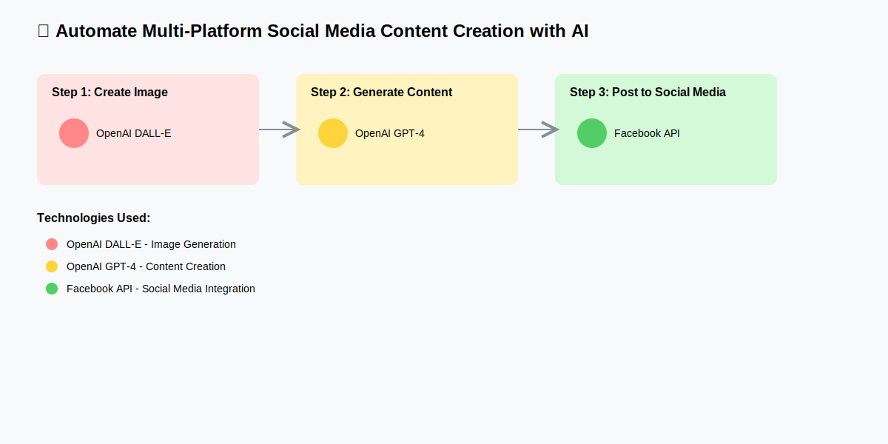

# 🤖 Tự động đăng bài Facebook từ Google Sheets

## 📝 Mô tả
Workflow này tự động hóa việc đăng bài lên Facebook từ dữ liệu trong Google Sheets, sử dụng AI để tạo nội dung và hình ảnh chất lượng cao.

## ✨ Tính năng chính
- 📊 Đọc dữ liệu từ Google Sheets
- 🤖 Tạo nội dung với OpenAI GPT-4
- 🎨 Tạo hình ảnh với DALL-E
- 📱 Tự động đăng lên Facebook
- ⏰ Lập lịch đăng bài tự động

## 🛠️ Công nghệ sử dụng
- Google Sheets
- OpenAI (GPT-4 & DALL-E)
- Facebook Graph API

  <button id="copyButton" onclick="copyWorkflow()" style="
    background-color: #37b24d;
    color: white;
    padding: 12px 24px;
    border: none;
    border-radius: 4px;
    font-size: 16px;
    cursor: pointer;
    margin: 20px 0;
  ">
    Use workflow
  </button>

## 👤 Tác giả
**Hải Quang**
- 📧 Email: haiquangbh1a1b1c@gmail.com
- 🌐 GitHub: [@insightfreedom247](https://github.com/insightfreedom247)

## 📄 Giấy phép
MIT License - Xem file [LICENSE](../../LICENSE) để biết thêm chi tiết